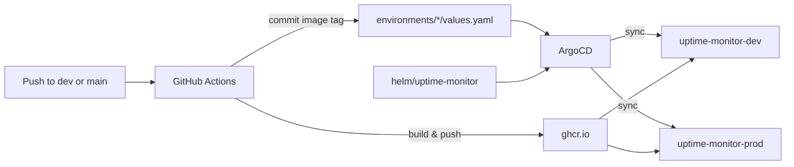

# uptime-monitor-gitops

GitOps repository for [uptime-monitor](https://github.com/SirajMoideen/uptime-monitor). Contains the Helm chart, per-environment values, and ArgoCD Application manifests used to deploy the app to a private Kind cluster.

ArgoCD watches this repo and auto-syncs (prune + self-heal) to `uptime-monitor-dev` and `uptime-monitor-prod`. Image tags are updated automatically by the CI pipeline in the application repo after each build.

> **Note:** Personal lab setup — both environments auto-deploy on push for demo purposes. Production-grade would use manual approval gates and staged rollouts.

---

## Related repositories

| Repository | Role |
| :--- | :--- |
| [uptime-monitor](https://github.com/SirajMoideen/uptime-monitor) | Flask app, Dockerfile, GitHub Actions CI |
| **uptime-monitor-gitops** | Helm chart, env values, ArgoCD apps *(this repo)* |
| [kind-platform](https://github.com/SirajMoideen/kind-platform) | Kind cluster, ingress, Prometheus/Grafana, Elasticsearch/Kibana/Filebeat |

---

## How it fits together



```
push to dev  →  build image  →  update environments/dev/values.yaml  →  ArgoCD syncs dev
push to main →  build image  →  update environments/prod/values.yaml →  ArgoCD syncs prod
```

CI workflow: [uptime-monitor/.github/workflows/docker-build-deploy.yml](https://github.com/SirajMoideen/uptime-monitor/blob/main/.github/workflows/docker-build-deploy.yml)

---

## Repository structure

```
uptime-monitor-gitops/
├── applications/
│   ├── dev.yaml              # ArgoCD Application → uptime-monitor-dev
│   └── prod.yaml             # ArgoCD Application → uptime-monitor-prod
├── environments/
│   ├── dev/values.yaml       # Dev overrides (image tag, ingress, replicas)
│   └── prod/values.yaml      # Prod overrides
└── helm/uptime-monitor/
    ├── Chart.yaml
    ├── values.yaml           # Default chart values
    └── templates/
        ├── deployment.yaml
        ├── service.yaml
        └── ingress.yaml
```

---

## Environments

| Environment | CI trigger branch | ArgoCD app | Namespace | Replicas | Ingress host |
| :--- | :--- | :--- | :--- | :--- | :--- |
| **Dev** | `dev` | `uptime-monitor-dev` | `uptime-monitor-dev` | 1 | `uptime-dev.local` |
| **Prod** | `main` | `uptime-monitor-prod` | `uptime-monitor-prod` | 2 | `uptime.local` |

Add to `/etc/hosts`:

```text
127.0.0.1 uptime-dev.local uptime.local
```

---

## First-time cluster setup

Requires a running Kind cluster with ArgoCD and NGINX Ingress. Follow the [kind-platform SOP](https://github.com/SirajMoideen/kind-platform#readme) to bootstrap the lab.

### 1. Register ArgoCD applications

```bash
kubectl apply -f applications/dev.yaml
kubectl apply -f applications/prod.yaml
```

### 2. Create namespaces and pull secret

```bash
for ns in uptime-monitor-dev uptime-monitor-prod; do
  kubectl create namespace "$ns" --dry-run=client -o yaml | kubectl apply -f -
  kubectl create secret docker-registry ghcr-secret \
    --docker-server=ghcr.io \
    --docker-username="$GHCR_USERNAME" \
    --docker-password="$GHCR_TOKEN" \
    -n "$ns"
done
```

### 3. Create application secrets

The Helm chart loads config from `uptime-monitor-secret` (see `helm/uptime-monitor/values.yaml`). Create it in each namespace before the first sync:

```bash
kubectl create secret generic uptime-monitor-secret \
  -n uptime-monitor-dev \
  --from-literal=DATABASE_URL='postgresql://uptime-user:<password>@postgres:5432/uptime-db' \
  --from-literal=CHECK_INTERVAL_SECONDS='20' \
  --from-literal=GOOGLE_CHAT_WEBHOOK=''
```

Repeat for `uptime-monitor-prod`. Never commit secret values to this repo.

### 4. Verify sync

```bash
kubectl get applications -n argocd | grep uptime-monitor
kubectl get pods -n uptime-monitor-dev
kubectl get pods -n uptime-monitor-prod
```

Force a refresh if needed:

```bash
kubectl annotate application uptime-monitor-dev -n argocd \
  argocd.argoproj.io/refresh=hard --overwrite
kubectl annotate application uptime-monitor-prod -n argocd \
  argocd.argoproj.io/refresh=hard --overwrite
```

---

## Helm chart

### Default values (`helm/uptime-monitor/values.yaml`)

| Key | Default | Description |
| :--- | :--- | :--- |
| `replicaCount` | `1` | Deployment replicas |
| `image.repository` | `ghcr.io/sirajmoideen/uptime-monitor` | Container image |
| `image.tag` | `latest` | Image tag — **updated by CI** |
| `imagePullSecrets` | `ghcr-secret` | GHCR pull credentials |
| `containerPort` | `5000` | App listen port |
| `service.port` | `80` | Service port exposed to Ingress |
| `ingress.enabled` | `true` | Create Ingress resource |
| `ingress.host` | `uptime.local` | Ingress hostname |
| `secretName` | `uptime-monitor-secret` | Secret with app env vars |

Environment-specific overrides live in `environments/dev/values.yaml` and `environments/prod/values.yaml`.

### Local render (optional)

```bash
helm template uptime-monitor ./helm/uptime-monitor \
  -f environments/dev/values.yaml
```

---

## Observability

This repo deploys the application only. Metrics and logging run on the same cluster via [kind-platform](https://github.com/SirajMoideen/kind-platform):

| Stack | Components | Ingress |
| :--- | :--- | :--- |
| **Metrics** | Prometheus, Grafana | `prometheus.local`, `grafana.local` |
| **Logging** | Elasticsearch, Kibana, Filebeat | `kibana.local` |

Filebeat ships container logs from all namespaces (including `uptime-monitor-dev` and `uptime-monitor-prod`) to Elasticsearch. Grafana dashboards and PromQL reference queries are in [sre-runbooks](https://github.com/SirajMoideen/sre-runbooks) under `prometheus-grafana-dashboards/`.

---

## Manual image tag update

Normally CI updates the tag on push. To pin a tag manually, edit the environment values file:

```yaml
# environments/dev/values.yaml
image:
  tag: abc1234   # commit SHA or semver tag
```

Commit and push — ArgoCD syncs within seconds.

---

## Author

**Siraj** — [GitHub profile](https://github.com/SirajMoideen)

Part of the [uptime-monitor](https://github.com/SirajMoideen/uptime-monitor) showcase lab.
